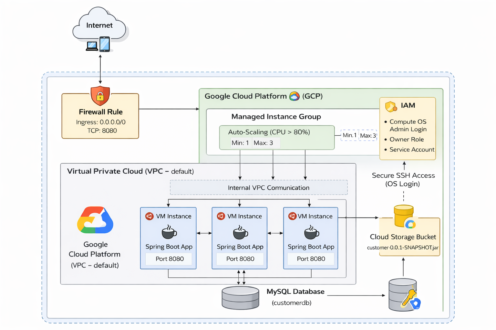

# Scalable Spring Boot Deployment on GCP

## Overview
This project demonstrates deployment of a Spring Boot microservice
on Google Cloud Platform with:

- Managed Instance Group (MIG)
- CPU-based Auto-scaling
- IAM-based SSH access
- OS Login integration
- Firewall configuration
- Internal VPC communication

## Architecture

## Tech Stack

- Java 17
- Spring Boot 3.2
- MySQL
- GCP Compute Engine
- Managed Instance Group
- Auto-scaler
- IAM & OS Login
- VPC Firewall Rules

---

## Deployment Steps

### 1. SSH into VM
### 2. Install dependencies
### 3. Download JAR from Cloud Storage
### 4. Run application
### 5. Validate auto-scaling using stress test

---

## Auto-Scaling Policy

- Min Instances: 1
- Max Instances: 3
- Target CPU: 80%
- Initialization Period: 60 seconds

---

## Firewall Rule

- Port 8080 open
- TCP protocol
- Source: 0.0.0.0/0